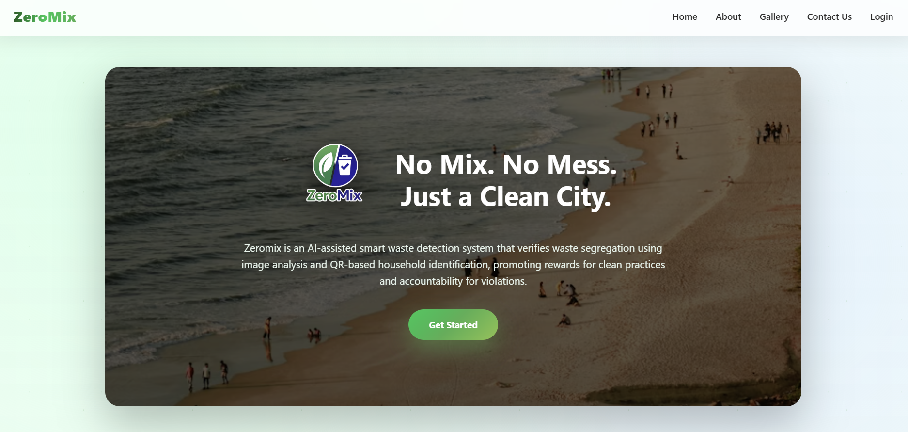
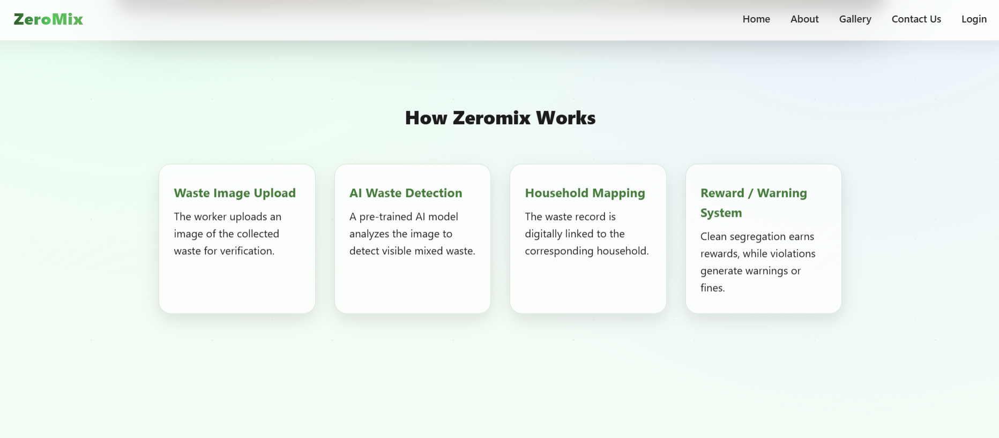
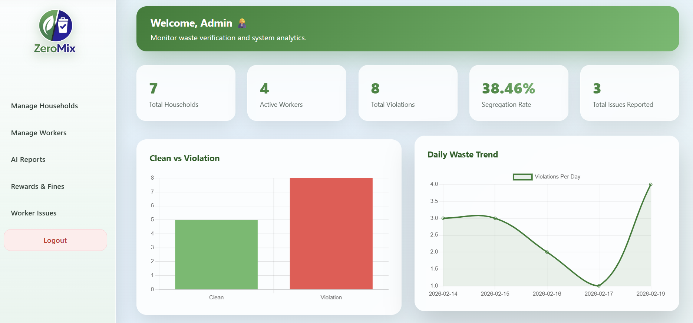
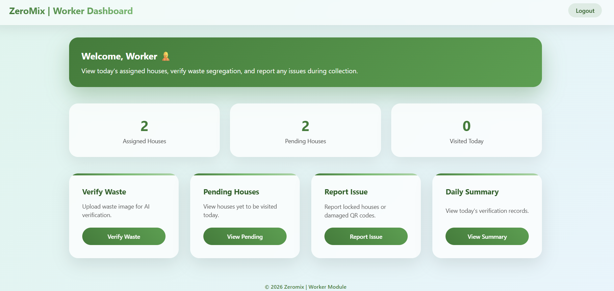
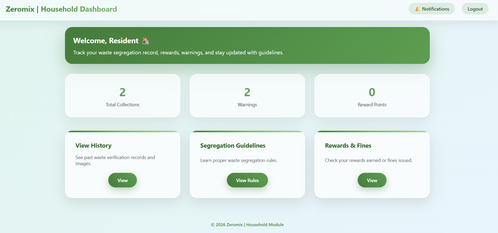
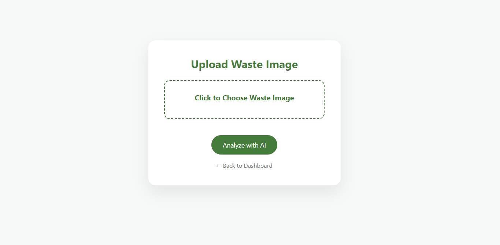
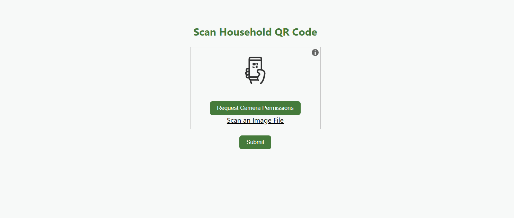

# 🌱 Zeromix – Smart Waste Detection & Segregation System

Zeromix is a web-based smart waste management system designed to improve household waste segregation through **AI-based waste verification, QR code linking, rewards, warnings, and fines**.

The system connects three main users:

- 👨‍💼 Admin
- 👷 Worker
- 🏠 Household

---

## 🎯 Objectives

- Encourage proper segregation of household waste.
- Use AI to verify uploaded waste images.
- Track waste collection and segregation performance.
- Reward households for proper segregation.
- Issue warnings and fines for repeated violations.
- Help administrators monitor the overall waste management process.

---

## 👥 User Modules

### 👨‍💼 Admin

The Admin manages the complete system.

**Features:**

- Add, update, and delete households
- Add and manage workers
- Assign workers to specific areas
- View household and worker information
- Monitor segregation performance
- Approve warnings and fines
- Approve reward points
- View waste reports
- View analytics and daily waste trends
- View and resolve worker-reported issues

---

### 👷 Worker

The Worker performs waste collection and verification.

**Features:**

- View assigned households
- View pending households
- Upload household waste images
- AI-based waste verification
- Scan household QR codes
- Link waste records to households
- Report issues to Admin
- View daily performance
- View completed and pending collections

---

### 🏠 Household

The Household can monitor its waste management activity.

**Features:**

- View total waste collections
- View warnings and violations
- View reward points
- View waste history
- View rewards and fines
- Receive notifications
- View waste segregation guidelines

---

## 🤖 AI Waste Verification

Zeromix uses a trained **TensorFlow/Keras image classification model** to analyze uploaded waste images.

The model is trained to classify waste into:

- ♻️ Biodegradable
- 🚫 Non-biodegradable

The prediction is then used by the application to determine whether the uploaded waste is considered:

- ✅ Clean
- ❌ Violation

The trained model is included in the project as:

`waste_model.keras`

> **Note:** The AI model is a prototype and its classification accuracy can vary depending on the image, lighting, background, waste quantity, and dataset quality.

---

## 🔄 System Workflow

    Admin
      ↓
    Adds Households & Workers
      ↓
    Assigns Workers to Areas
      ↓
    Worker Visits Household
      ↓
    Worker Uploads Waste Image
      ↓
    AI Verifies Waste
      ↓
    Clean / Violation
      ↓
    Worker Scans Household QR
      ↓
    Waste Record is Stored
      ↓
    Reward / Warning / Fine
      ↓
    Household Dashboard

---

### Reward & Violation Logic

**Clean waste:**

- Reward points are generated.
- Admin can approve the reward.

**Violation:**

- Warning is issued.
- Repeated violations can result in a fine.

**Fine:**

- After repeated warnings, a ₹500 fine can be issued.

---

## 📱 QR Code System

Each household is associated with a unique QR code.

The QR code contains the household identifier in the following format:

    HOUSEHOLD:<username>

The Worker scans the QR code after uploading the waste image to link the waste record to the correct household.

QR codes are generated using the Python `qrcode` library.

---

## 📊 Main Features

- 🤖 AI-based waste image verification
- 📷 Waste image upload
- 📱 Household QR code generation and scanning
- 👥 Role-based authentication
- 🏠 Household management
- 👷 Worker management
- 📍 Worker area assignment
- ⚠️ Warning and fine system
- 🎁 Reward points system
- 📈 Admin dashboard analytics
- 📋 Waste reports
- 📊 Worker performance tracking
- 🔔 Household notifications
- 📝 Worker issue reporting
- 📚 Waste segregation guidelines

---

## 📸 Application Screenshots

### 🏠 Homepage

### 🔄 How Zeromix Works

### 👨‍💼 Admin Dashboard

### 👷 Worker Dashboard

### 🏠 Household Dashboard

### 📱 QR Code Scanning

### ♻️ Waste Image Upload

### 🤖 AI Verification Reports

### 🎁 Rewards & Fines

---

## 🛠️ Technologies Used

| Technology | Purpose |
|---|---|
| Python | Backend programming |
| Flask | Web framework |
| MySQL | Database |
| TensorFlow / Keras | AI model |
| OpenCV | Image processing |
| HTML | Web structure |
| CSS | Styling |
| JavaScript | Client-side functionality |
| Bootstrap | UI design |
| QRCode | QR code generation |

---

## 🏗️ Project Structure

    Zeromix/
    │
    ├── app.py
    ├── database.py
    ├── household_admin.py
    ├── waste_model.keras
    ├── requirements.txt
    ├── .gitignore
    │
    ├── templates/
    │   ├── Admin pages
    │   ├── Worker pages
    │   └── Household pages
    │
    ├── static/
    │   ├── images/
    │   ├── uploads/
    │   └── qr_codes/
    │
    └── screenshots/
        ├── admin_dashboard.png
        ├── ai_verification_report.png
        ├── homepage.png
        ├── homepage2.png
        ├── household_dashboard.png
        ├── rewards_and_fines_overview.png
        ├── scan_qr.png
        ├── upload_waste.png
        └── worker_dashboard.png

> `.env`, uploaded waste images, generated QR codes, and the Python virtual environment are excluded from the GitHub repository.

---

## ⚙️ Installation & Setup

### 1. Clone the repository

    git clone <your-repository-url>
    cd Zeromix

### 2. Create a virtual environment

    python -m venv venv

Activate it on Windows:

    venv\Scripts\activate

### 3. Install dependencies

    pip install -r requirements.txt

### 4. Configure environment variables

Create a `.env` file in the project folder:

    DB_HOST=localhost
    DB_USER=root
    DB_PASSWORD=
    DB_NAME=zeromix
    SECRET_KEY=your_secret_key

### 5. Set up MySQL

Create a MySQL database named:

    zeromix

Create the required tables based on the database structure used by the application.

### 6. Run the application

    python app.py

Open the application in your browser:

    http://127.0.0.1:5000

---

## 🔐 Security

The project uses:

- Session-based authentication
- Role-based access control
- Secure filename handling
- Password hashing for newly created accounts
- Environment variables for configuration and secrets

Sensitive configuration such as database credentials and Flask secret keys should be stored in `.env` and excluded from Git using `.gitignore`.

---

## ⚠️ AI Model Limitation

The AI component is a prototype trained for waste classification.

Image classification performance may not always be reliable when:

- Multiple types of waste appear together.
- Wet and dry waste are mixed.
- Waste is partially hidden.
- Images have poor lighting.
- Background objects are present.
- The uploaded image differs significantly from the training dataset.

Therefore, AI predictions should be considered as **prototype verification results** rather than a perfect real-world waste segregation decision.

---

## 🚀 Future Improvements

- Improve the AI model using a larger and more diverse dataset.
- Detect multiple types of waste in the same image.
- Improve mixed-waste detection.
- Add real-time camera-based waste detection.
- Improve model accuracy and validation.
- Add mobile application support.
- Add advanced analytics and reporting.
- Integrate notifications through email or SMS.

---

## 👩‍💻 Project

**Zeromix – Smart Waste Detection & Segregation System**

A web-based project combining **AI, waste management, QR technology, rewards, and administrative monitoring** to encourage better household waste segregation.

